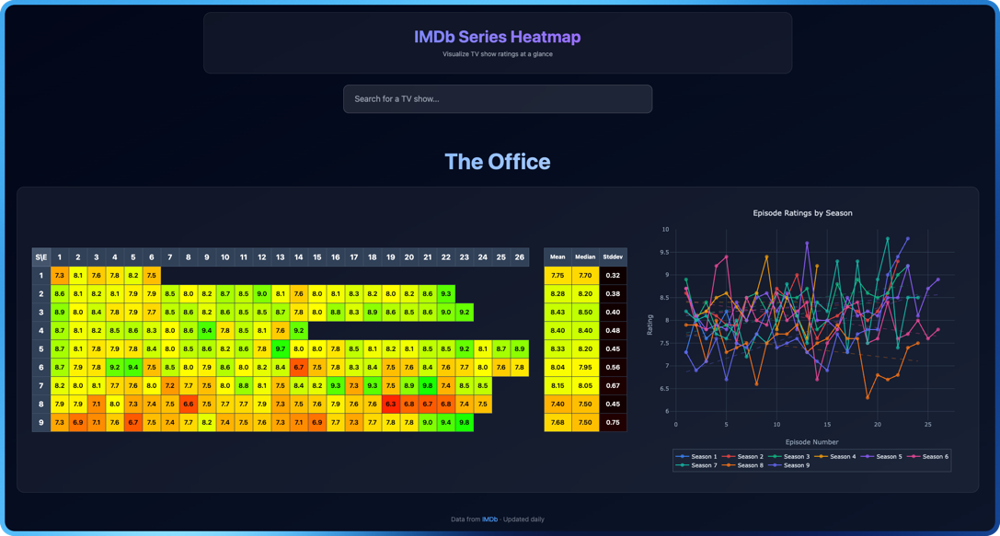

# IMDb Ratings

Website that visualizes IMDb ratings of TV show episodes as interactive heatmaps.

**Live Site:** https://amterp.github.io/imdb-ratings/



A fork of [mokronos](https://github.com/mokronos)'s excellent project [imdb-heatmap](https://github.com/mokronos/imdb-heatmap).

Main changes include:

- Revamped frontend/theme/color scheme
- Stats table (mean/stddev, etc per season)
- Ratings charting
- [And more thinks planned!](./REVAMP.md)

## How to Run

Located in `app/` - Modern React + TypeScript application with updated UI:

```bash
cd app
npm install
npm run dev
```

Then open http://localhost:5173 (or whichever port Vite assigns) in your browser.

**Tech Stack:**

- React 18 + TypeScript
- Vite 7
- TanStack Query (React Query)
- React Router
- Headless UI
- Tailwind CSS v4

**Requirements:** Node.js 22+ (tested with v25.1.0)

## How it Works

**Data Generation:**

The Python script (`scripts/create_dataset.py`) downloads IMDb data and saves the top 2500 shows as one `{title, id}` JSON file (`data/titleId.json`). It then generates individual JSON files for each show ID, containing ratings for every episode across all seasons.

The scripts run every 24h via a cron job through GitHub Actions. The generated JSON files are automatically pushed to the repo.

**Frontend:**

The React application loads the show catalog from `data/titleId.json`, provides an autocomplete search interface, and dynamically loads episode data for the selected show. Episode ratings are displayed as a color-coded heatmap using HSL color gradients (red → orange → yellow → green).

## Issues

Dataset generation takes way too long (1h48min) for 1000 shows. Currently using pandas to combine the databases. Takes a while to figure out which of the IDs are actually shows, and to collect all the IDs of the episodes. Probably can be optimized.

Series "Married... with Children" doesn't get generated.
Probably because of the first unrated pilot episode.

Need to manage duplicates in the dataset. Currently there are 2 "The Office" series, one can't be accessed.
Could add year and/or force selection.

Game of Thrones doesn't work, for some reason?
